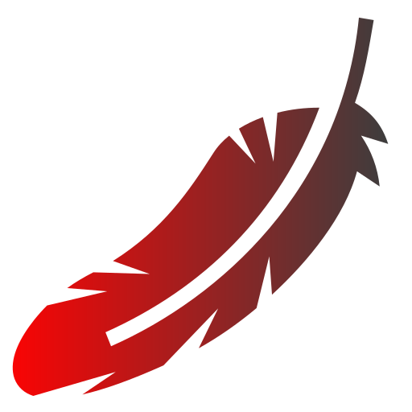

<div align="center">


# Min
#### "React-Lua is bloatware, Fusion is too complicated, I want something *simpler*!" - an idiot

<a href="https://opensource.org/license/mit/"></a>
<a href="https://roblox.com"></a>

---
</div>

Min is a Reactive UI library for Roblox inspired by [VanJS](https://github.com/vanjs-org/van), designed with portability, typings and simplicity in mind.

This library (when minified and bundled with [Darklua](https://github.com/seaofvoices/darklua)) weights around 4kb~, but it does not really matter inside the Roblox enviorment. It contains every single necessary piece for a functional UI Library with inspirations from diverse other libraries alike with simple and minimal code.

Contributions, big or small, are very welcome. Incluinding code minimization or optimizations!

## Examples

<div align="center"> 

**Creating/Hydrating Instances**

</div>

```lua
local Min = require(path.to.min)
local Make, State, Changed = Min.Make, Min.State, Min.Changed

local AnState = State(0)
Make("Frame", {
    Name = "Hello", -- direct declaration
    Destroyed = function(Inst) -- declaration for functions, which always receive the instance as its argument and then any argument passed by the function

    end,
    Text = AnState, -- reactive declaration, prop changes if state/derived changes
    Make("TextButton", {}), -- instances inside the table will be added as children,
    function(Inst) 
        -- you can insert functions inside the table, which will be ran after
        -- the instance was finalized. this is called a hook.
    end,
    Changed("Text", function(Inst)
        print("Text Changed!")
        -- with hooks you can pretty much extend anything on Min
    end)
})
```

<div align="center"> 

**Reactiveness**

</div>

```lua
local Min = require(path.to.min)
local State, Derive, Watcher = Min.State, Min.Derive, Min.Watcher

local Count = State(0) -- states are objects that store a value, they can be observed by Watchers or dependable by Deriveds.

local Double = Derive(function()
    -- derived are objects that compute things using atleast one State, they update every time any State inside them changes

    return Count.value * 2 -- to get the value of a State or Derived object, index "value".
end)

local Destroy = Watcher(Double, function()
    -- finally, watchers fire the function passed to it whenever the reactive object updates it's value.
    print("Doubled!")
end)
```

<div align="center"> 

**Components**

</div>

```lua
local Min = require(path.to.min)
local Make = Min.Make
local Component, Empty = Min.Component, Min.Empty
local State, Derive = Min.State, Min.Derive

local Button = Component({
    OnClick = Empty,
    Count = 0,
    Name = "" -- this will be autohydrated, meaning it will be added to the instance even though its not mentioned in the callback
}, function(Props) -- Props will have type inference!
    local Count = State(Props.Count)
    local Double = Derive(function()
        return Count.value * 2
    end)

    return Make("TextButton", {
        Text = Double, -- Prop will be updated after the derived changes value.
        Activated = function(Inst)
            Props.OnClick(Inst)
            Count.value += 1
        end,

        Make("UICorner", {
            CornerRadius = UDim.new(0.2,0)
        })
    })
end)
```
---
<div align="center">

#### "Everyone can do something interresting, even small." - me in the shower

</div>